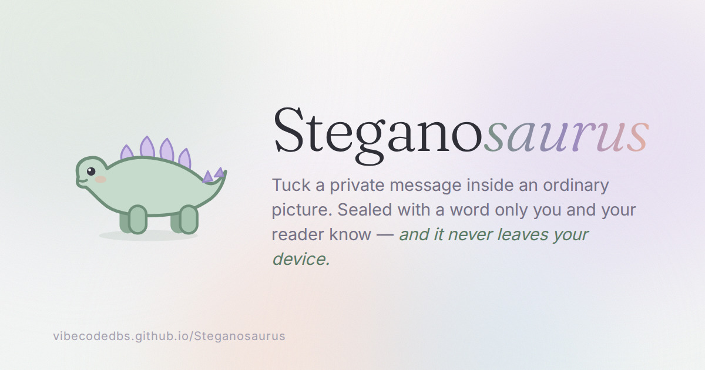

<div align="center">



# Steganosaurus

**Quiet messages, hidden in pictures.**

A very old, very quiet creature who swallows your message and looks completely normal about it.

[**→ Try it**](https://vibecodedbs.github.io/Steganosaurus/)

</div>

---

Steganosaurus hides an encrypted message inside an ordinary image. Give it a picture, some words, and a secret word — it hands back a PNG that looks identical to the original but is quietly carrying your message. Anyone with the same secret word can get it back out.

Everything runs in the browser. No uploads, no server, no accounts, no analytics, and not a single external request — fonts and all are embedded. The page is one HTML file you can read end to end, and it works offline.

## How it works

Three things happen when you hide a message:

1. **Encrypt.** Your secret word is stretched into a 256-bit key with PBKDF2-SHA256 (210,000 iterations, random 16-byte salt). The message is encrypted with AES-256-GCM, which also authenticates it — tampering is detected, not silently decrypted into garbage.

2. **Scatter.** The same secret word seeds a deterministic PRNG (sfc32), which drives a streaming partial Fisher–Yates shuffle over *every* red/green/blue least-significant bit in the image. That shuffle decides where each bit of the payload goes. Without the secret word you don't know which bits to even look at.

3. **Embed.** Each payload bit replaces the last bit of one colour value — a change of ±1 out of 255, invisible to the eye. The alpha channel is left completely untouched.

Decoding regenerates the same shuffle from the secret word, reads a 36-byte header, checks a magic number, and decrypts. Wrong word → the magic number doesn't match → clean "no message found", with no way to tell a wrong password from an empty image.

### Payload layout

| Field | Size | Notes |
|---|---|---|
| magic | 4 B | `DINO` — lets the decoder confirm the right key before doing any work |
| salt | 16 B | random, per message, for PBKDF2 |
| iv | 12 B | random, per message, AES-GCM nonce |
| length | 4 B | uint32 big-endian, ciphertext length |
| ciphertext | *n* B | AES-256-GCM output, including the 16-byte auth tag |

### Capacity

Three bits per pixel, minus 52 bytes of overhead:

```
usable bytes ≈ (width × height × 3 / 8) − 52
```

A 1920×1080 photo holds about **760 KB** of text. A 400×400 avatar holds about **60 KB**. The meter under the message box shows this live.

## Things worth knowing

**Always send the PNG as a file.** Any re-compression destroys the message — the hidden data lives in the exact pixel values, and JPEG doesn't preserve those. Messaging apps, social media, and most image previews re-save what you upload. Email attachments, cloud drive links, AirDrop, and USB sticks are all fine. If in doubt, zip it.

**Resizing, cropping, filters, and screenshots also destroy it.** The image has to arrive byte-identical to how it left.

**Transparency is flattened onto white.** Transparent PNGs get an opaque background so the pixel values round-trip exactly. If transparency matters to your picture, composite it yourself first.

**Pick a real secret word.** The encryption is only as strong as what you choose. `sunset` is not a password; a short passphrase of several unrelated words is. There is no recovery — lose the word, lose the message.

**This hides that a message exists, and encrypts it if found.** The scattering makes casual detection hard, but a determined analyst with statistical tools and the original image can often tell *something* was embedded. They still can't read it. Treat it as privacy and delight, not as protection from a hostile state.

## Hosting it yourself

It's one file with no build step.

1. Fork or clone this repo.
2. **Settings → Pages → Source: GitHub Actions.**
3. Push to `main`. The included workflow deploys it.

It'll be live at **https://vibecodedbs.github.io/Steganosaurus/**.

If you'd rather have it at the bare root — `https://vibecodedbs.github.io/` with no path — name the repo `vibecodedbs.github.io` instead, and update the three absolute URLs in `index.html`'s `og:`/`twitter:` meta tags to match.

Or skip hosting entirely — download `index.html` and open it directly. It works the same from `file://`.

## Development

There isn't any. Open `index.html` in a browser, edit it, refresh. No dependencies, no bundler, no `node_modules`.

Fraunces and Inter are embedded in the file as base64 woff2, so the page makes **zero external requests** and works fully offline — nothing to install, nothing phoning home. That's most of the file size; the actual app is about 40 KB.

## Browser support

Needs `crypto.subtle`, which browsers only expose on `https://` or `localhost` — a bare `http://` host will break it. Works in current Chrome, Firefox, Safari and Edge.

## Licence

MIT. See [LICENSE](LICENSE).
